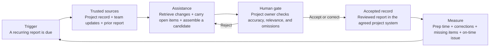

# `/starter` workflow diagram specification

Date: 2026-09-28

Status: internal content evidence; client-neutral draft; requires content approval before page use

## Job of the diagram

Show the difference between “using AI” and installing one controlled workflow. A buyer should understand the operating sequence in five seconds without reading a product architecture.

## Page-ready sequence

The reverse edge is essential. A candidate that fails review returns for correction; it does not become a project record because software produced it.

## Six labels and what each must prove

| Stage | Public label | Operating requirement | Evidence boundary |
|---|---|---|---|
| Trigger | A recurring report is due | Named cadence or event starts the workflow. | No vague “AI assistant is always watching” claim. |
| Trusted sources | Project record + team updates + prior report | Sources are named, permissioned, and current enough for the job. | Do not imply one source is authoritative for every field. |
| Assistance | Retrieve changes + carry open items + assemble a candidate | The system can gather and structure evidence without silently deciding what controls. | Candidate state only; no fabrication or unsupported inference. |
| Human gate | Project owner checks accuracy, relevance, and omissions | A named reviewer can accept, correct, reject, or request missing evidence. | Professional and project judgment stays with the responsible person. |
| Accepted record | Reviewed report in the agreed project system | The accepted version has a destination, owner, and retained source trail. | A chat response or generated draft is not the record. |
| Measure | Prep time + corrections + missing items + on-time issue | The firm can decide whether the change works, needs revision, or should stop. | No savings claim without a baseline and observed live cycles. |

## Evidence behind the pattern

The private operating evidence is a recurring project-report workflow:

- the source audit records approximately six hours / one working day per week spent reassembling information that already exists;
- a held-out weekly replay used a prior report plus 147 project-channel messages to generate a candidate against a preserved real target;
- the candidate carried forward the expected items and status changes without fabrication observed in that replay;
- its material difference was over-inclusion, supporting the need for a human curation gate in this workflow rather than autonomous issue.

This evidence supports the control pattern. It does not authorize the client name, project details, screenshots, burden figure, or result for public use.

## Visual direction

- One horizontal rail with six distinct stages; do not use a dashboard or architecture-diagram visual.
- Give the human gate the strongest visual emphasis.
- Show the correction loop from human gate back to assistance.
- Visually separate the candidate from the accepted record.
- Use one short verb and one short evidence line per stage.
- Avoid vendor logos; the mechanism must remain true regardless of the selected tool.

## Page caption

> A useful AI workflow does not end with a draft. It starts from agreed sources, passes through a named human review, lands in the system the team already relies on, and produces evidence about whether the change works.

## Approval checklist

- [ ] Josh approves the six-stage story and caption.
- [ ] The selected public example is cleared for use.
- [ ] Any screenshot or artifact is redacted and permissioned.
- [ ] The reviewer title and accepted destination are accurate.
- [ ] The measures are observable for the selected workflow.
- [ ] Final visual is reviewed at desktop and mobile sizes.

## Sources

- `content-briefs/01-ai-operations-implementation-architecture-firms.md`
- `starter-evidence-packet-2026-09-28.md`
- `/Users/joshweiss/code/cortextos/orgs/clearworksai/agents/auditmaster-codex/deliverables/alloi/99-alloi-audit-master.md`
- `/Users/joshweiss/code/cortextos/orgs/clearworksai/agents/auditmaster-codex/deliverables/alloi/tactical-training/proof-0721/PROOF-RESULT.md`
- `/Users/joshweiss/code/clearworks-sites/site/src/data/aecAnswerLibrary.ts`
